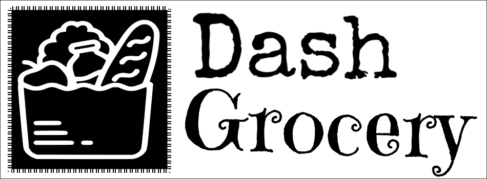

[](https://pypi.org/project/dash-dash-grocery/)


<table style="margin: auto; table-layout: fixed;">
  <tr>
    <td width="45%">
      <a href="https://dash.plotly.com/">
        
      </a>
    </td>
    <td align="center">
      <span>➕➖✖➗</span>
    </td>
    <td width="45%">
      <a href="https://github.com/IcToxi/dash-grocery">
        
      </a>
    </td>
  </tr>
</table>


# Dash Grocery

Dash Grocery is a Dash component library. The purpose of this package is to collect interesting and useful React projects to wrap. I'm excited to have the first release, PRs are welcome!

# Quickstart

```python
import dash_grocery
from dash import Dash, html

app = Dash(__name__)

app.layout = html.Div(
    [
        dash_grocery.Textfit(
            dash_grocery.Clock(format="dddd, MMMM Mo, YY, HH:mm:ss", ticking=True),
            max=400,
            mode="single",
        )
    ]
)


if __name__ == "__main__":
    app.run(debug=True)
```

# Contributing
1. Clone the project locally.
```bash
gh repo clone IcToxi/dash-grocery
```
2. Install dependencies.
```bash
yarn
```
3. Create your component under `./src/lib/components` and edit the `index.js`.
4. Create a branch and raise a PR, it would be nice to have a detailed description.
   
# TODO
1. Introduce CI.
2. Add testing.
3. Update documentation.
4. More interesting components.
